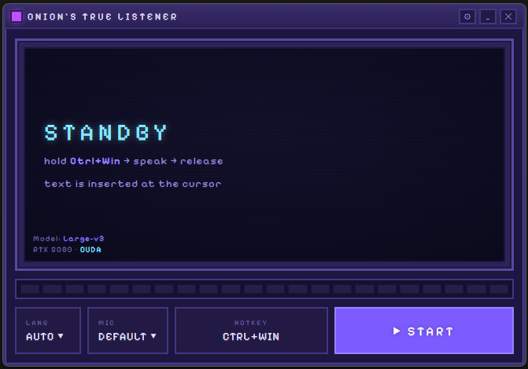

# Onion's True Listener

<p align="center">
  
</p>

Local, **offline** push-to-talk dictation for Windows. Hold a hotkey, speak
(Ukrainian / English / mixed), release — the recognized text is pasted straight
into whatever field your cursor is in. Everything runs on your machine on the
GPU; nothing is sent to the cloud.

A self-hosted alternative to Wispr Flow, built for code-switched
Ukrainian + English tech speech (e.g. *"зроби функцію яка робить `fetch` до API"*).

## Features

- 🎙️ **Global push-to-talk** — hold **F9** in any app, speak, release.
- ⚡ **GPU transcription** — Whisper `large-v3` via CUDA. ~0.5–0.8 s for a short phrase.
- 🇺🇦🇬🇧 **Ukrainian + English + mixed** — keeps English terms in Latin, Ukrainian in Cyrillic.
- 📋 **Pastes into the focused field** of any application (clipboard + Ctrl+V).
- 🔔 Audio cues for "listening" / "done".
- 🌐 Language switch (Ukrainian / English / Auto), remembered between runs.
- 🔒 100% local & offline.

## How it works

```
[hold F9 globally]  ── uiohook-napi captures keydown/keyup
       │
       ▼
[capture mic]       ── Web Audio (renderer) → PCM 16-bit mono 16 kHz
       │
[release F9]
       ▼
[transcribe]        ── @fugood/whisper.node (CUDA, large-v3) in the main process
       ▼
[paste]             ── restore the previously-focused window → clipboard + Ctrl+V
```

The native Whisper module runs in Electron's main process; audio capture happens
in the renderer and is sent over IPC. The window is a normal, focusable window —
on key-down we remember the foreground window, and before pasting we restore
focus to it so `Ctrl+V` lands in the right place.

## Requirements

- **Windows** (x64)
- **NVIDIA GPU with CUDA compute capability 12.0** (Blackwell / RTX 50xx).
  Developed and tested on an RTX 5080.
  > The prebuilt CUDA Whisper binary targets cc 12.0 specifically. Other GPUs may
  > need a different variant (`vulkan`) — see notes below.
- **Node.js 20+**
- A recent NVIDIA driver (CUDA 12.x capable).

## Setup

### 1. Install dependencies

```sh
npm install
```

### 2. Provide the CUDA runtime DLLs ⚠️ (required)

The `@fugood/whisper.node` CUDA variant ships `index.node` but **not** the CUDA
runtime DLLs it depends on, so it fails to load (and silently falls back to CPU)
until you add them. Download the CUDA **12.9** redistributables and copy three
DLLs next to the binary:

Source: <https://developer.download.nvidia.com/compute/cuda/redist/>

- `cudart64_12.dll`   — from `cuda_cudart` (12.9.79)
- `cublas64_12.dll`   — from `libcublas` (12.9.1.4)
- `cublasLt64_12.dll` — from `libcublas` (12.9.1.4)

Copy them into:

```
node_modules/@fugood/node-whisper-win32-x64-cuda/
```

> A full CUDA Toolkit (~3 GB) is **not** required — just these three DLLs.
> `cublasLt64_12.dll` is ~668 MB.

### 3. Get a model

Models aren't bundled. On first launch the app shows **CHOOSE MODEL** and lets you
download one (one time) into the user-data folder:

- **Large-v3** (~3.1 GB) — best quality, heavier
- **Large-v3 Turbo** (~1.6 GB) — almost as good, faster, lighter

Manage models any time via **⚙ → Models**: switch the active model, download more
(Large-v3 / Turbo / Medium / Small), or delete ones you don't need.

For development you can instead drop a model next to the code at
`models/<file>.bin` (a local copy wins, so it isn't re-downloaded):

```sh
curl -L -o models/ggml-large-v3.bin \
  https://huggingface.co/ggerganov/whisper.cpp/resolve/main/ggml-large-v3.bin
```

### 4. Run

```sh
npm start
```

## Usage

1. Pick a dictation language in the app (default: Ukrainian, which also keeps
   embedded English tech terms).
2. Put your cursor in any text field, in any app.
3. **Hold F9**, speak, **release** — the text is pasted at the cursor.

The in-app window also has a manual record button (shows text without pasting)
and a **Copy** button.

## Configuration

- **Hotkey**: click the **Hotkey** button in the app, then press & release the key
  or combo. Works with single keys (`F9`), modifier+key (`Ctrl+Space`), and
  modifier-only combos (`Ctrl+Win`). `Esc` cancels. Default is **F9**.
- **Model**: switch / download / delete via **⚙ → Models**.
- **Language**: pick UKR / ENG / AUTO in the toolbar.

Settings persist (hotkey & active model in `config.json` under user-data, language
in `localStorage`).

## Build

```sh
npm run build      # clean -> build -> dist/onions-true-listener-<ver>-win-x64.zip
```

Or step by step: `npm run dist` (just `dist/win-unpacked/`) then `npm run zip`.

> The build prints a `winCodeSign` "cannot create symbolic link" error — that's
> harmless. We build a `dir` target and zip it ourselves, so signing isn't needed;
> the script ignores that error and still produces the app + zip.

## Known limitations

- Windows / NVIDIA (CUDA) only for now — see [PLATFORMS.md](./PLATFORMS.md).
- The recognized text stays in the clipboard (it's also the manual-paste fallback).
- Whisper picks a single language per utterance; very short clips can be
  mis-detected. Forcing the language (instead of "Auto") avoids this.

## Roadmap

See [IMPLEMENTATION.md](./IMPLEMENTATION.md). Short version: tray icon / hide
window, on-screen recording indicator, autostart, packaging to a standalone
`.exe`, and an optional local LLM cleanup pass.

## Tech stack

- [Electron](https://www.electronjs.org/)
- [@fugood/whisper.node](https://github.com/mybigday/whisper.node) — Whisper.cpp Node binding (CUDA)
- [uiohook-napi](https://github.com/SnosMe/uiohook-napi) — global keyboard hook
- Web Audio API for capture; PowerShell for paste / focus restore

## License

MIT
